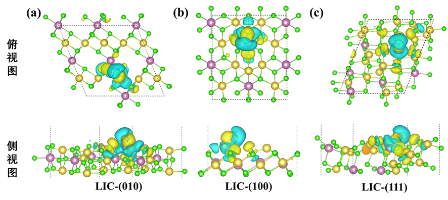
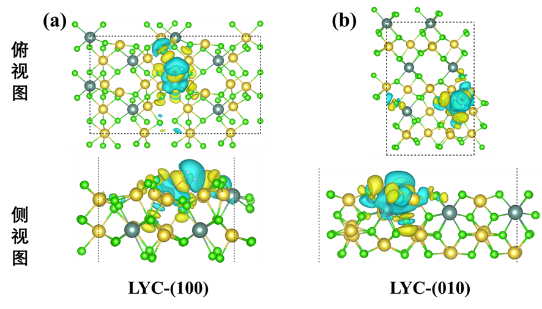

    通过DFT计算差分电荷密度是突出电荷的再分配和对比电荷区域之间的轨道静电相互作用的一种有效方法，可以用于分析水分子再LMC表面吸附的静电相互作用。其中Δe的计算公式为
                  ∆e=e_ads- e_(surface⁄(H_2 O))           (4-3)
	其中e_ads为吸附后的bader电荷值，e_(surface⁄(H_2 O))为吸附前表面和水分子的bader电荷值。其中，bader电荷绝对值为所带电子的数量，正负号表示所带电荷的类型。对于阳离子来说，Δe为正时，表示吸附后所带正电荷增多，Δe为负时，表示吸附后所带正电荷减少。对于阴离子来说，即所带的正电荷越少；反之亦然。对于阴离子，Δe为正时，表示吸附后所带负电荷减少；反之亦然。
	Bader电荷结果如表5-1所示，可以看到一个共性的结论，对于O原子来说，吸附后所带的负电荷都减少了，H原子吸附后所带的 正电荷都增多了，说明吸附后，O吸引周围阳离子的能力减弱，而从O-H的相互作用来看，其
	如图5-2为LMC吸附位点水分子吸附的差分电荷密度图，直观展示了水分子吸附发生的电荷转移。 水分子中的氢原子与表面氧原子之间存在电荷转移， 因为水分子的轴向区域出现了电荷消耗区，其下方的 In/Y 或 Li 原子同样出现了电荷消耗区域，而水分子与表面之间则出现了电荷累积的区域，对于与下方In/Y或Li原子所配位的Cl原子，出现了电荷累积区域。水分子在氧原子周围表现出增强的电子密度，而在氢原子周围表现出电子密度耗尽趋势。同时，可以看到H原子指向的Cl原子的中间区域出现了电荷累计的区域，说明水分子在表面的吸附构型会产生氢键相互作用。比较水与整个系统其他部分的静电作用，可以发现， 水分子是通过正负区域交替与表面原子进行电荷的再分配，主要通过 3a1与 1b1 轨道静电承载。
system	surface	O	H1	H2
		Δe	Δe	Δe	Δe
LIC	(010)-Li	-0.015575	-0.090144	+0.04216	+0.02643
	(100)-Li	-0.014738	-0.114076	+0.06193	+0.05027
	(111)-In	0.060756	-0.023369	+0.04138	+0.05665
LYC	(100)-Y	0.04326	-0.124637	+0.07336	+0.06314
	(110)-Li	0.0019	-0.163415	+0.08367	+0.06847

