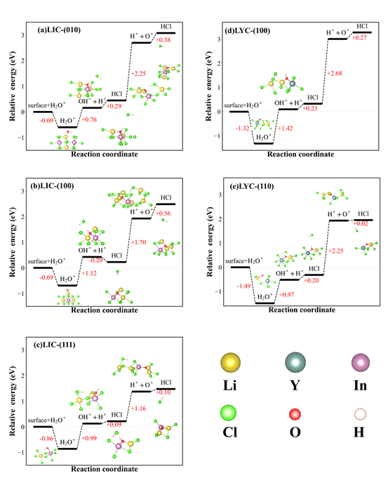
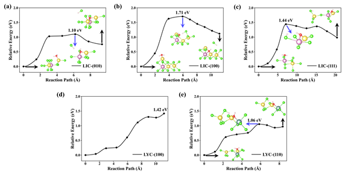
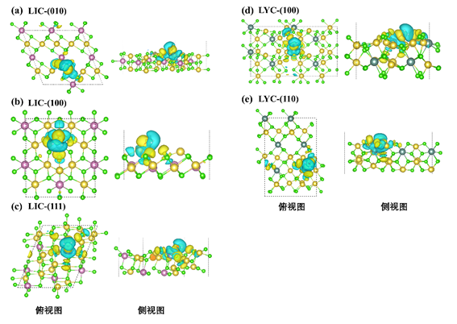
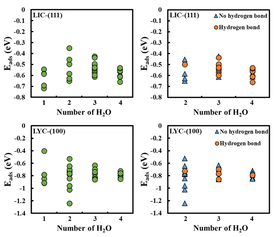
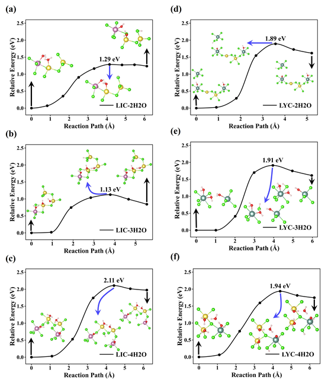

# [第]()4章 H~2~O在Li~3~MCl ~6~ (M=In/Y)表面的水解机理的研究

## [4.1

]()研究背景

近年来，全固态锂电池（ASSLBs）因其高能量密度和高安全性的潜力而备受瞩目。在众多固态电解质候选材料中，金属卤化物固态电解质 Li~3~MCl ~6 ~ (M=In,Y) 凭借其优异的室温离子电导率、良好的机械延展性以及对高电压正极材料出色的氧化稳定性，重新成为了研究热点，被视为下一代高比能电池的关键材料 [Air-stable Li3InCl6 electrolyte with high ionic conductivity for
all-solid-state lithium batteries，Solid halide electrolytes with high lithium-ion
conductivity for all-solid-state lithium batteries]。然而，尽管其电化学窗口宽且界面相容性好，卤化物电解质对环境中的水分表现出极高的敏感性，这一“吸湿不稳定性”已成为制约其从实验室走向规模化应用的最主要瓶颈 [Air Stability of Solid-State Sulfide Batteries and Electrolytes]。

已有实验研究表明，Li~3~MCl~6~暴露于潮湿大气环境时，水分子会迅速吸附于材料表面，并诱发一系列复杂的物理化学过程。初期可能仅形成水合物相，但在一定条件下，吸附的水分子会进一步发生不可逆的解离反应，导致材料晶格结构的坍塌与恶化。这种结构破坏带来的后果是双重的：一方面，高导电的晶体骨架被破坏，导致体相离子传输受阻；另一方面，水解副产物会在颗粒表面形成钝化层，显著增大晶界阻抗，最终导致电池性能的急剧衰减 [New Cost‐Effective Halide Solid Electrolytes for All‐Solid‐State
Batteries: Mechanochemically Prepared Fe3+‐Substituted Li2ZrCl6]。其中，HCl气体的生成是该降解过程中最典型的化学特征，也是判断材料是否发生深度水解的重要标志。

深入研究这一失效过程的微观机制，对指导抗吸湿性的卤化物固态电解质的设计具有重要意义，从原子尺度来看，水分子与卤化物固态电解质表面的相互作用模式决定了反应的走向。之前的计算结果也指出，吸附态的H~2~O分子并不是随机去向的，表现出显著的取向特异性，即水分子中的H原子倾向于只想表面的Cl原子，形成类似氢键的相互作用，这可能会预先削弱表面M-Cl键和水分子内部O-H键的强度，这种由吸附构型引起的电子态的重排，可能会对反应能垒由降低的作用，为后续触发水解反应创造有利条件。

基于上述的机理认识，可以将H2O分子在表面的反应过程归纳为两个关键的连续步骤。在水分子完成稳定的表面吸附后，第一步是水分子的解离，即H2O分子在表面上水解为吸附态的羟基OH和活性氢原子H，解离出的H原子与临近的Cl原子结合，在表面上进行脱附释放出HCl气体；第二步是残留的OH基团进一步发生脱H降解，分解为O原子和H原子，H原子再次与表面的Cl结合生成第二个HCl分子。这一过程不仅破坏了结构中的骨架，还在表面留下了难移除的氧化物杂质。

因此，本研究采用第一性原理计算方法，结合过渡态搜索和电子结构分析，从原子层面重构了但水分子在表面吸附和水解的全过程，重点验证上述反应机理生成HCl的可能性。关于具体的计算参数设置和细节，详见 2.4 节，本章不再赘述。

## [4.2 ]()计算方法

本章的计算工作主要依托于上一章节已构建并验证的Li~3~MCl~6~表面模型及能量最低的水分子吸附构型进行进一步的计算。计算软件和计算参数与第三章一致。为了评估水分子在固体电解质表面的化学活性，通过计算反应过程中的能量变化来判断水解反应的热力学可行性。反应能

定义为反应体系在某一特定状态（如中间体或产物）的能量相对于初始反应物状态的能量差[Trends
in the exchange current for hydrogen evolution]，计算公式如下：

其中，

为反应路径上某一特定构型（如吸附态、过渡态或产物态）的系统总能量；

为洁净 表面的能量；

为真空中孤立水分子的能量。在此定义下，

被视为参考态能量零点。若

<0，表明该步骤为放热反应，热力学上倾向于自发进行。

在水解反应的动力学分析方面，本研究采用爬坡微动弹性带方法 (Climbing Image Nudged Elastic Band, CI-NEB) [A climbing image
nudged elastic band ethod for finding saddle points and minimum energy paths]来搜寻反应的最小能量路径  并定位过渡态。为了准确描绘复杂的解离过程，路径构建策略如下：在确定的初态和末态之间，根据反应路径的几何长度插入适量数目的中间图像，通常保证相邻图像间的几何距离适中（约1Å左右），以确保路径的平滑性与计算的稳定性，收敛标准设定为迁移原子与路径正交的力的最大范数小于0.1 eV·Å^-1^。

## [4.3 ]()单水水解结果

### [4.3.1 Li~3~MCl ~6~ (M=In/Y)]()单水水解

水分子在卤化物固态电解质表面的解离反应过程计算结果如图
4-1 所示。对于 Li~3~InCl~6~体系，其不同表面水分子第一步解离能介于 0.77~0.89 eV 之间，第二步解离能为 1.16~2.25 eV；而Li~3~YCl~6~体系的第一步解离能为 0.96~1.09 eV，第二步解离能更高，高达 2.25~2.68 eV。从热力学角度对比可知，无论是
Li~3~InCl~6~还是Li~3~YCl~6~，其解离能均显著高于硫化物固态电解质 Li₆PS₅Cl体系的解离能[硫化物固态电解质 Li₆PS₅Cl 水失稳机制的第一性原理研究]，表明卤化物体系在初始水解阶段具有更强的热力学稳定性。

进一步对同一表面水分子解离的关键步骤分析可见，两步解离过程中第二步解离能均高于第一步：Li~3~InCl~6~体系第二步解离能较第一步最高差值达 1.48 eV，Li~3~YCl~6~体系最高差值达 1.62 eV。根据热力学判据，解离能越高，反应自发进行的可能性越低，因此水分子在卤化物固态电解质表面的第二步解离更难发生，第一步解离是水解反应的热力学优先步骤。

鉴于第一步解离在热力学上的高发生概率，有必要进一步对其动力学过程展开探究，相关计算结果如图 4-2所示。结果显示，Li~3~InCl~6~体系水分子第一步解离的反应能垒为 1.04~1.71 eV，Li~3~YCl~6~体系则为 1.41 eV；从动力学角度看，两类卤化物体系的解离能垒均大于 1 eV，且远高于 LPSC 体系的解离能垒。这一结果表明，在卤化物体系中，即使是热力学优先的第一步解离，也需克服较高的动力学能垒，反应速率受到显著限制。

综合热力学与动力学分析可知，卤化物固态电解质对水分子第一步解离具有较高的能垒，这意味着初始水解反应的自发性收到抑制，该结论与 Ji-Su Kim 在研究结果一致[Theoretical analysis of reversible phase
evolution in Li-ion conductive halides]。

图4-1(a)
Li~3~InCl~6~和(b)Li~3~YCl~6~各表面反应热力学图。

图4-2
相变示意图 (a) LIC和(b)LYC各表面第一步解离反应动力学能垒图。

### [4.3.2 ]()Li~3~MCl ~6~ (M=In/Y)单水水解bader分析，dos

由上述计算结果可知，在热力学和动力学上都表现出解离反应的难发生性。因此，有必要对电子结构进行研究，从根本来揭示其第一步反应。对于解离反应来说，其反应的初态是关键，有必要对初态进行电子结构的进一步描述。同时，通过DFT计算差分电荷密度是突出电荷的再分配和对比电荷区域之间的轨道静电相互作用的一种有效方法，可以用于分析水分子再LMC表面吸附的静电相互作用。其中Δe的计算公式为：

其中

为吸附后的bader电荷值，

为吸附前表面和水分子的bader电荷值。其中，bader电荷绝对值为所带电子的数量，正负号表示所带电荷的类型。对于阳离子来说，Δe为正时，表示吸附后所带正电荷增多，Δe为负时，表示吸附后所带正电荷减少。对于阴离子来说，即所带的正电荷越少；反之亦然。对于阴离子，Δe为正时，表示吸附后所带负电荷减少；反之亦然。

Bader电荷结果如表5-1所示，可以看到一个共性的结论，对于O原子来说，吸附后所带的负电荷都减少了，H原子吸附后所带的 正电荷都增多了，说明吸附后，O吸引周围阳离子的能力减弱，而从O-H的相互作用来看，其

如图4-3为LMC吸附位点水分子吸附的差分电荷密度图，直观展示了水分子吸附发生的电荷转移。
水分子中的氢原子与表面氧原子之间存在电荷转移， 因为水分子的轴向区域出现了电荷消耗区，其下方的
In/Y 或 Li 原子同样出现了电荷消耗区域，而水分子与表面之间则出现了电荷累积的区域，对于与下方In/Y或Li原子所配位的Cl原子，出现了电荷累积区域。水分子在氧原子周围表现出增强的电子密度，而在氢原子周围表现出电子密度耗尽趋势。同时，可以看到H原子指向的Cl原子的中间区域出现了电荷累计的区域，说明水分子在表面的吸附构型会产生氢键相互作用。比较水与整个系统其他部分的静电作用，可以发现，
水分子是通过正负区域交替与表面原子进行电荷的再分配，主要通过 3a1与 1b1 轨道静电承载。

表4-1：固态电解质LIC和LYC的吸附原子和水分子的bader电荷的变化量

| system   | surface   | O         | H1        | H2       |          |
| -------- | --------- | --------- | --------- | -------- | -------- |
|          |           | Δe       | Δe       | Δe      | Δe      |
| LIC      | (010)-Li  | -0.015575 | -0.090144 | +0.04216 | +0.02643 |
| (100)-Li | -0.014738 | -0.114076 | +0.06193  | +0.05027 |          |
| (111)-In | 0.060756  | -0.023369 | +0.04138  | +0.05665 |          |
| LYC      | (100)-Y   | 0.04326   | -0.124637 | +0.07336 | +0.06314 |
| (110)-Li | 0.0019    | -0.163415 | +0.08367  | +0.06847 |          |
|          |           |           |           |          |          |

图4-2 LIC和LYC各表面差分电荷示意图。

## [4.4]()水浓度对水解的影响

上述分析揭示了单水分子在LIC与LYC表面的解离规律，但未考虑实际应用场景中"多水分子共存"的客观条件。在固态电解质的实际服役环境中，多水分子共存是普遍现象：一方面，材料制备、储存及组装过程中难以完全避免环境湿度的波动；另一方面，电池长期循环过程中界面处微量水分的逐步累积亦会形成局部高水浓度区域。在这些场景下，水分子间可能通过氢键形成协同网络结构，这种分子间相互作用可能对单个水分子的吸附构型、解离路径乃至反应能垒产生调控作用。因此，为更贴合实际工况、全面揭示卤化物固态电解质的水稳定性本质，有必要将研究体系从单水分子拓展至多水分子场景，系统探究水覆盖度对吸附与解离行为的影响机制，明确水浓度与吸附能、解离能垒之间的定量关联规律。

考虑到表面终端暴露原子的多样性以及水分子优先吸附于高价阳离子位点的特性，本节选用3.2节所获得的LIC(111)晶面和LYC(100)晶面构建多水吸附模型，对多水分子的吸附及解离全过程进行能量计算。基于前文结论——第一步解离在热力学上具有更高的发生概率，本节动力学计算聚焦于解离反应的初始步骤。

### [4.4.1 Li~3~MCl ~6~ (M=In/Y)]()多水吸附

干燥空气环境中，单水分子吸附代表了低覆盖度条件下水分子与材料表面的基本相互作用模式，可用于理解初始吸附机制。然而，在实际的大气环境中，固态电解质发生潮解通常处于较高湿度条件下[Air
Sensitivity and Degradation Evolution of Halide Solid State Electrolytes upon
Exposure]，此时水分子之间存在的氢键网络作用显著，其协同吸附行为可能显著改变界面反应路径与热力学稳定性。从分子层面分析，相邻水分子可通过氢键相互连接，形成二聚体、三聚体乃至更大的团簇结构。这种协同吸附行为可能通过以下途径影响界面反应：改变单个水分子的吸附几何构型、调控水分子中O-H键的活化程度和影响解离产物在表面的稳定化方式。因此，仅考虑单水吸附不足以全面反映真实界面化学过程，有必要系统开展多水分子协同吸附研究，以更准确地模拟实际潮解行为的初始阶段。因此，仅考虑单水吸附无法全面反映真实界面化学过程，有必要开展多水分子在表面的协同吸附研究，以更准确地模拟实际潮解过程。

为探究不同水覆盖度对材料表面稳定性及潮解初期微观机制的影响，本工作针对Li₃MCl₆（M=In/Y）电解质表面开展了2、3及4个水分子吸附的DFT计算。模型构建时，在每个表面体系中系统性地考虑了多种初始构型：（1）水分子均匀分布于不同高价阳离子位点的分散构型；（2）水分子相互靠近并可能形成氢键的团簇构型；（3）水分子呈链状排列的线性构型。每种初始构型均经过充分的结构弛豫以获得局域能量最低构型。为兼顾计算效率与结构代表性，选取LIC-(111)晶面与LYC-(100)晶面作为模型体系，这两个表面在前期研究中均表现出良好的结构稳定性与典型的原子暴露特征，分别代表了In基和Y基卤化物电解质的典型界面。其中，多水分子体系的平均吸附能按下式计算：

其中，

为吸附

个水分子后体系的总能量，

为清洁表面的能量，

为水分子的能量，

为吸附的水分子数目。该定义下，负值越大表示吸附越稳定。

计算结果如图4-3所示。图4-3(a)和(c)分别展示了LIC-(111)和LYC-(100)表面吸附1-4个水分子时所有优化构型的吸附能分布。在LIC-(111)表面，单水分子吸附能约为-0.45至-0.55 eV，随着水分子数目增加至2、3、4个，平均吸附能分别分布在-0.35至-0.55 eV、-0.45至-0.55 eV和-0.45至-0.55 eV范围内。可以观察到，吸附能数值随水分子数目的增加并未表现出单调变化趋势，各覆盖度下的吸附能分布范围基本重叠。类似地，在LYC-(100)表面，单水分子吸附能约为-0.35至-1.20 eV，呈现较大的分布范围，这与该表面存在多种非等价吸附位点有关。当水分子数目增加时，平均吸附能稳定在-0.65至-0.95 eV范围内，同样未观察到与覆盖度相关的显著变化。

为进一步厘清水分子间氢键作用对吸附热力学的影响，我们根据优化后构型中水分子间是否存在氢键对数据进行了分类统计，结果示于图4-3(b)和(d)。在LIC(111)表面，有氢键构型（橙色圆点）与无氢键构型（蓝色三角）的吸附能数据点在整个覆盖度范围内高度重叠，二者之间无法区分出系统性差异。具体而言，在2个水分子吸附时，有氢键构型吸附能为-0.40至-0.55 eV，无氢键构型为-0.50至-0.65 eV；在3和4个水分子吸附时，两类构型的吸附能均分布在-0.40至-0.55 eV范围。LYC(010)表面呈现相同的规律：有氢键与无氢键构型的吸附能均在-0.65至-1.00 eV范围内波动，未表现出统计学上的显著差异。

上述结果表明，在该类卤化物固态电解质表面，水分子吸附行为主要由水-表面相互作用主导，而非水分子间的氢键作用。这一现象可从能量尺度的角度得到合理解释：水分子与表面高价阳离子之间的静电相互作用及配位键合作用是吸附能的主要贡献项，其强度通常在0.4-1.0 eV量级；而水分子间单个氢键的典型强度仅为0.1-0.25 eV。因此，氢键的形成或断裂对总吸附能的相对贡献较小（约10-20%），难以在当前的计算精度下产生可分辨的系统性差异。此外，从几何构型角度分析，水分子在表面的吸附取向主要受水-阳离子相互作用的约束——氧原子倾向于指向表面阳离子以最大化静电吸引，这在一定程度上限制了水分子间形成最优氢键几何的自由度。即使水分子间形成了氢键，其键长和键角也可能偏离气相水团簇中的最优值，导致氢键强度有所削弱。

值得注意的是，吸附覆盖度的变化在所研究范围内（1-4个水分子）亦未显著改变吸附热力学稳定性。这一结果具有重要的实际意义：它表明在潮解初期阶段，材料表面各吸附位点可被视为相互独立，水分子的吸附行为遵循朗缪尔（Langmuir）型吸附模型的基本假设。换言之，已吸附的水分子对后续水分子的吸附既不产生明显的促进作用（协同效应），也不产生明显的抑制作用（位阻效应）。但是，热力学稳定性的相似并不意味着动力学行为的等同。水分子间的氢键网络虽未显著改变吸附能，但可能通过质子传递机制（Grotthuss机制）影响解离反应的过渡态结构与活化能垒。因此，下一节将进一步开展多水分子体系的解离动力学计算，以完整揭示水覆盖度对卤化物电解质表面解离反应的调控作用。

图4-3 (a)(b)LIC(111)和(c)(d)LYC(010)表面吸附不同数量水分子的吸附能。(a)(c)为所有构型汇总，(b)(d)按有无氢键分类。

### [4.4.1 Li~3~MCl ~6~ (M=In/Y)]()多水水解

述分析揭示了单水分子在Li~3~InCl~6~与Li~3~YCl~6~表面的解离规律，但未充分考虑实际应用场景中“多水分子共存”的客观条件。无论是材料制备过程中的环境湿度波动，还是电池循环中界面微量水分的逐步累积，均可能在局部形成高浓度的水环境。在此环境下，水分子间的相互作用（如氢键网络）可能显著影响解离反应的动力学路径。因此，为更贴合实际工况、全面揭示卤化物固态电解质的水稳定性本质，有必要将研究体系从单水分子拓展至多水分子场景，系统探究水浓度对解离行为的调控机制，建立水浓度与解离能垒及反应动力学之间的定量关联。鉴于前文热力学分析表明第一步解离具有高的发生概率，本节计算聚焦于不同水覆盖度下（2H~2~O、3H~2~O、4 H~2~O）首个水分子的第一步解离反应。计算结果如图4-4所示，展示了随着表面水分子数量增加，LIC-(111)和LYC-(100)表面发生第一步解离反应的能量变化路径。图中反应坐标的起点对应初始吸附态，能量最高点对应过渡态，末态对应解离产物吸附态。

对于LIC-(111)面，表面的解离能垒随水分子数量呈现非线性变化。当水分子数为2时，解离能垒为1.29 eV。增加至3个水分子时，能垒略微降低至1.13 eV。结合吸附模型分析，这一阶段水分子较少，表面空间充裕。适量的氢键网络能够在解离的时候产生形成类似于质子传递通道的，在解离的H~2~O分子中的H向邻近Cl原子移动后，剩余的OH基团会接受到最紧邻H质子的传递，重新形成H2O，这样的H质子的传递在通过过渡态时的重排有助于分散电荷，从而在动力学上略微降低了反应势垒。当水分子增至4个时，解离能垒陡升至2.11
eV，与上述水解不同的是，尽管产生了氢键网络，但是在解离时没有发生H质子的传递。回顾4.4.1节结论，虽然4个水分子的吸附能在数值上与少水分子相当，说明其吸附态在热力学上是稳定的；但在动力学上，高密度的水分子层在表面构建了刚性的氢键网络及致密的空间排布。
第一步解离需要断裂O-H键并驱动质子向邻近Cl位点迁移，这一过程必然伴随着显著的局域结构畸变，，同时没有发生H质子的传递作用降低能垒，使得达到过渡态需要克服较高的能垒。回顾4.3.1节LIC-(111)面解离的能垒为1.44 eV，此时也没有H质子的传递作用，这再一次验证了氢键网络中H质子的传递作用对解离过程具有促进效果。

如图4-4(d-f)所示，LYC-(100)表面的不同水分子浓度下的解离能垒整体维持在较高水平，且随水分子数量增加波动较小。在水分子为两个时，解离能垒为 1.89 eV，解离反应遵循传统的直接解离路径。过渡态结构显示，水分子中的一个H质子直接向表面邻近的晶格Cl原子迁移，形成HCl，能垒为 1.89 eV。当水分子数量增至3个和4个时，反应路径出现了H质子的传递作用，仔细观察图4-4(e)和(f)的过渡态（TS）可以看出，解离后剩余的OH基团，利用相邻水分子作为质子给体，接受来自近邻的H质子。尽管在3H₂O（1.91 eV）和4H₂O（1.94 eV）的高覆盖度下，LYC表面已经启动了动力学上通常更为有利的质子传递协同机制，但其解离能垒并未因此降低，甚至比2H2O的解离能垒还更高，这一现象似乎是反直觉的。

同时对比LIC和LYC的解离能垒，总体而言，LYC的解离能垒远高于LIC的解离能垒，这与实验上LIC的水稳定性更加是不符的，因此水解路径也许不是LIC和LYC产生这一差异的根本原因。

